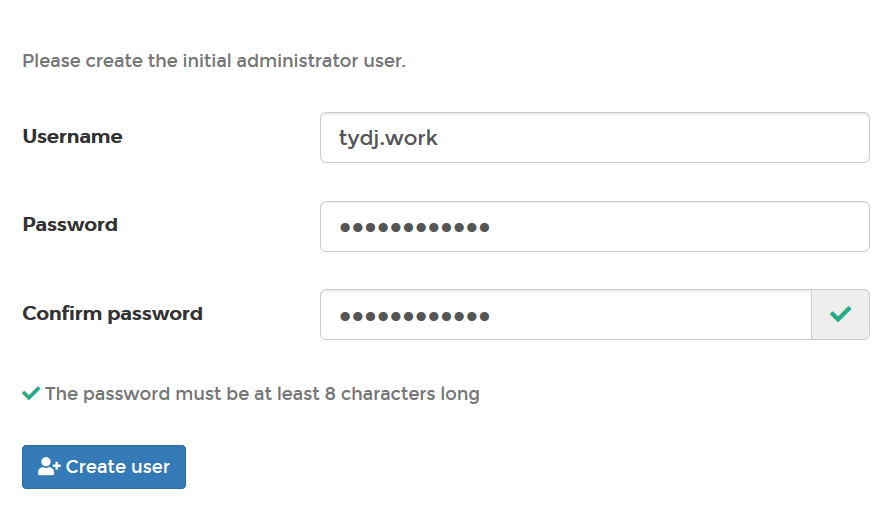

[toc]

## table

| site      | user     |
| --------- | -------- |
| dockerhub | tydjwork |
| github | - |

## screenshot
### portainer (http://localhost:9000)

#### install
	docker volume create portainer_data
	docker pull portainer/portainer (optional)
	docker run -d -p 9000:9000 -v //var/run/docker.sock:/var/run/docker.sock -v portainer_data:/data --name portainer portainer/portainer

#### to restart docker service	
	Restart-Service com.docker.service
#### to remove volumes
	docker volume ls <vName>
	docker volume rm 